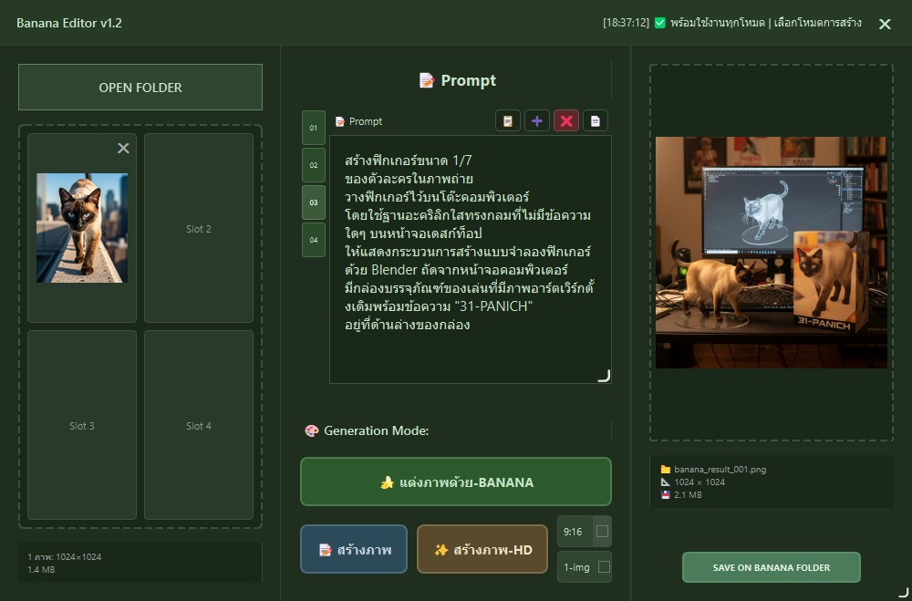

# 🍌 Banana Editor - Standalone Version

เครื่องมือ Image-to-Image editing อิสระ ด้วย Gemini 2.5 Flash API


## 📸 ภาพรวมโปรแกรม


*หน้าตาโปรแกรม Banana Editor Standalone พร้อมธีม Navy Green และฟีเจอร์การแก้ไขภาพด้วย AI*

## ⚠️ **ข้อควรทราบก่อนใช้งาน**
- **ต้องใช้ Paid API Key เท่านั้น** - Free API Key ไม่รองรับการสร้างภาพ
- **ค่าใช้จ่าย**: $0.039 ต่อภาพที่สร้าง (ประมาณ 1.2 บาท)

## 🌟 คุณสมบัติหลักของโปรแกรม

### 🎨 **3 โหมดการสร้างภาพแบบ AI**
- 🍌 **แต่งภาพด้วย-BANANA**: Image-to-Image editing ด้วย Gemini 2.5 Flash - แก้ไขภาพที่มีอยู่แล้วตามคำสั่ง
- 📝 **สร้างภาพ**: Text-to-Image ด้วย Gemini 2.5 Flash - สร้างภาพใหม่จากข้อความ  
- ✨ **สร้างภาพ-HD**: Text-to-Image ด้วย Imagen-4 - คุณภาพสูงสุดจาก Google พร้อมเลือก aspect ratio ได้

### 🌟 **จุดเด่นเหนือกว่า Gemini ทั่วไป**
- 🚀 **สร้างพร้อมกัน 1-4 ภาพ**: ต่างจาก Gemini ใน AI Studio ที่สร้างทีละ 1 ภาพ
- 🚫 **ไม่มีลายน้ำ**: ต่างจาก Gemini ทั่วไปที่มี watermark ที่มุมล่าง
- 🔓 **Safety Filter Bypass**: สร้างภาพได้อิสระมากกว่า ไม่โดน content policy จำกัด
- 📁 **บันทึกอัตโนมัติ**: ไม่ต้อง right-click save เหมือนใน web browser
- ⚡ **ประสิทธิภาพสูง**: เชื่อมต่อ API โดยตรง ไม่ผ่าน web interface ทำให้เร็วกว่า

### 🖼️ **ระบบจัดการภาพ**
- 📁 **รองรับหลายภาพ**: นำเข้าได้สูงสุด 3 ภาพพร้อมกัน สำหรับงาน composite
- 🔍 **Floating Image Viewer**: คลิกดูภาพขนาดใหญ่แบบลอยตัว พร้อม zoom
- 💾 **บันทึกอัตโนมัติ**: เลือกบันทึกในโฟลเดอร์เดิม หรือโฟลเดอร์ `banana/` แยกต่างหาก
- 📊 **แสดงข้อมูลภาพ**: ขนาด, ความละเอียด, และข้อมูลไฟล์

### 🎨 **การออกแบบและการใช้งาน**
- 🌙 **Navy Green Theme**: ธีมสีเขียวกรมท่า (#304530) สบายตา เหมาะสำหรับงานยาวๆ
- 📚 **ระบบประวัติ**: บันทึกคำสั่งที่ใช้แล้ว เรียกใช้ซ้ำได้ทันที
- ⌨️ **Keyboard Shortcuts**: Ctrl+Enter สำหรับสร้างภาพเร็ว
- 🖱️ **ใช้งานง่าย**: Interface เรียบง่าย เน้นประสิทธิภาพการทำงาน

### 🔧 **ความยืดหยุ่น**
- 📷 **Command-line support**: โหลดภาพตั้งแต่เปิดโปรแกรมด้วย `--preload-image`
- 🔄 **Multiple instances**: เปิดได้หลายหน้าต่างพร้อมกัน
- 💻 **Standalone**: ทำงานอิสระ ไม่ต้องพึ่งโปรแกรมอื่น
- 🌐 **Cross-platform**: รองรับ Windows, macOS, Linux

## 🚀 วิธีการใช้งาน

### เริ่มต้นใช้งาน
```bash
# เปิดโปรแกรม
python banana_editor_standalone.py

# หรือเปิดพร้อมโหลดภาพ
python banana_editor_standalone.py --preload-image path/to/image.jpg
```

### 🎨 3 วิธีสร้างภาพ

#### 1. 🍌 แต่งภาพด้วย-BANANA (Image-to-Image)
- เลือกภาพต้นฉบับ (ปุ่ม "OPEN FOLDER" หรือ drag & drop)
- พิมพ์คำสั่งแก้ไข เช่น "เปลี่ยนเป็นสีแดง", "เพิ่มหมวก", "ใส่แว่นตา"
- กดปุ่ม "🍌 แต่งภาพด้วย-BANANA"

#### 2. 📝 สร้างภาพ (Text-to-Image)
- พิมพ์คำอธิบายภาพ เช่น "แมวส้มนั่งบนโต๊ะไม้"
- กดปุ่ม "📝 สร้างภาพ"
- ได้ภาพคุณภาพปกติ

#### 3. ✨ สร้างภาพ-HD (Imagen-4)
- พิมพ์คำอธิบายภาพอย่างละเอียด
- เลือก aspect ratio (9:16, 1:1, 16:9)
- กดปุ่ม "✨ สร้างภาพ-HD"
- ได้ภาพคุณภาพสูงสุด

### 🔥 เทคนิคการใช้งานขั้นสูง
- **สร้างทีละ 4 ภาพ**: เลือกจำนวนภาพที่ต้องการใน dropdown (1-4 ภาพ)  
- **ใช้ประวัติ**: คลิกเลือกคำสั่งเก่าจากแถบด้านซ้าย
- **ดูภาพใหญ่**: คลิกที่ภาพผลลัพธ์เพื่อดูแบบลอยตัว
- **บันทึกเร็ว**: Ctrl+Enter เพื่อสร้างภาพด้วย Gemini 2.5 Flash

### 📝 ตัวอย่างการใช้งานจริง

#### 🍌 แต่งภาพ (Image-to-Image)
```
ภาพต้นฉบับ: รูปแมวสีดำ
คำสั่ง: "เปลี่ยนเป็นแมวสีส้ม ใส่หมวกแดง เพิ่มแว่นตากันแดด"
ผลลัพธ์: แมวสีส้มใส่หมวกแดงและแว่นตา
```

#### 📝 สร้างภาพใหม่ (Text-to-Image)
```
คำสั่ง: "วิวทะเลยามพระอาทิตย์ตก เรือใบเล็กๆ นกนางนวลบิน สีส้มอบอุ่น"
ผลลัพธ์: ภาพทะเลสวยงามตามที่อธิบาย (ไม่มีลายน้ำ)
```

#### ✨ สร้างภาพ HD (Imagen-4)
```
คำสั่ง: "Portrait photo of a golden retriever in a flower field, professional photography, 85mm lens, shallow depth of field, golden hour lighting"
Aspect Ratio: 9:16 (สำหรับโซเชียล)
ผลลัพธ์: ภาพคุณภาพสูง เหมาะพิมพ์หรือใช้งานพาณิชย์
```

## ข้อกำหนดระบบ

### Python Dependencies
- Python 3.8+
- PySide6 (PyQt6)
- PIL (Pillow)
- python-dotenv (optional)

### Environment Variables
- `GEMINI_API_KEY`: Google Gemini API Key (จำเป็น) - **ต้องเป็น Paid API Key เท่านั้น**

### ติดตั้ง Dependencies
```bash
pip install PySide6 Pillow python-dotenv
```

## การตั้งค่า

### 1. Clone repository
```bash
git clone https://github.com/iarcanar99/banana-editor-standalone.git
cd banana-editor-standalone
```

### 2. ติดตั้ง dependencies
```bash
pip install -r requirements.txt
```

### 3. ตั้งค่า API Key
สร้างไฟล์ `.env` จากตัวอย่าง:
```bash
cp .env.example .env
```

แก้ไขไฟล์ `.env`:
```env
GEMINI_API_KEY=your_paid_gemini_api_key_here
```

### ⚠️ **ข้อกำหนด API Key ที่สำคัญ**
- **Gemini 2.5 Flash Image Preview ไม่รองรับ Free Tier**
- **ต้องใช้ Paid API Key เท่านั้น** (เปิดใช้งาน billing account)
- **ค่าใช้จ่าย**: $0.039 ต่อภาพที่สร้าง
- **Free API Key จะได้รับ Error 429** หลังจากใช้งานเพียง 1-2 ครั้ง

### Settings
- ตั้งค่าจะถูกเก็บใน QSettings โดยใช้ organization "BananaEditor"
- History จะถูกเก็บในไฟล์ `banana_history.json`

## โครงสร้างไฟล์

```
banana_editor_build/
├── banana_editor_standalone.py    # โปรแกรมหลัก
├── test_standalone.py             # สคริปต์ทดสอบ
├── README.md                      # คู่มือนี้
└── banana_history.json           # ไฟล์ประวัติ (สร้างอัตโนมัติ)
```

## 💡 เปรียบเทียบกับเครื่องมืออื่น

| คุณสมบัติ | Banana Editor | Gemini AI Studio | ChatGPT/DALL-E |
|---------|---------------|------------------|----------------|
| จำนวนภาพต่อครั้ง | 1-4 ภาพ | 1 ภาพ | 1 ภาพ |
| ลายน้ำ | ❌ ไม่มี | ✅ มี "G" | ✅ มี signature |
| Safety Filter | 🔓 Bypass ได้ | 🔒 จำกัด | 🔒 จำกัดมาก |
| Image-to-Image | ✅ รองรับ | ❌ ไม่มี | ✅ รองรับ (จำกัด) |
| บันทึกอัตโนมัติ | ✅ โฟลเดอร์เลือกได้ | ❌ ต้องบันทึกเอง | ❌ ต้องบันทึกเอง |
| ราคา | $0.039/ภาพ | $0.039/ภาพ | $0.040/ภาพ |
| ความเร็ว | ⚡ เร็ว (API ตรง) | 🐌 ช้า (Web UI) | 🐌 ช้า (Rate limit) |

## การแก้ไขปัญหา

### ปัญหาที่พบบ่อย
1. **Import Error**: ตรวจสอบ dependencies และ Python version
2. **API Key Error**: ตั้งค่า GEMINI_API_KEY ใน environment variables
3. **Error 429 (Quota Exceeded)**: API Key เป็น Free Tier - **ต้องเปลี่ยนเป็น Paid API Key**
4. **UI แสดงผิด**: ตรวจสอบ PySide6 version
5. **การสร้างภาพล้มเหลว**: ตรวจสอบว่า API Key มี billing account เปิดใช้งาน

### ล็อกการแก้ไขปัญหา
- ดูข้อความใน console สำหรับข้อมูล debug
- ตรวจสอบไฟล์ log ถ้ามี

## เวอร์ชัน

- **Version**: 1.0.0
- **Build Date**: September 2, 2025
- **Based on**: banana_editor.py (Promptist 3.5)

## 👤 About Developer

**iarcanar** - Indie developer & AI enthusiast 🤖

- 🌟 **Previous Project**: [Magicite Babel](https://iarcanar99.github.io/magicite_babel/) - Real-time translation tool
- 🎯 **Specialization**: AI integration, GUI development, automation tools
- 💡 **Philosophy**: Making AI tools accessible for everyone

### Other Projects
- 🔮 **Magicite Babel**: Real-time language translation with advanced AI
- 🍌 **Banana Editor**: AI-powered image editing (this project)

## 📄 License

MIT License - สร้างจาก Promptist Banana Editor โดยลบ IPC features เพื่อให้ใช้งานได้อิสระ

### Credits
- Original concept from Promptist project
- Developed by **iarcanar**
- Powered by Google Gemini 2.5 Flash API
- UI framework: PySide6

---
*Made with ❤️ by [iarcanar](https://github.com/iarcanar99) | Check out [Magicite Babel](https://iarcanar99.github.io/magicite_babel/)*
